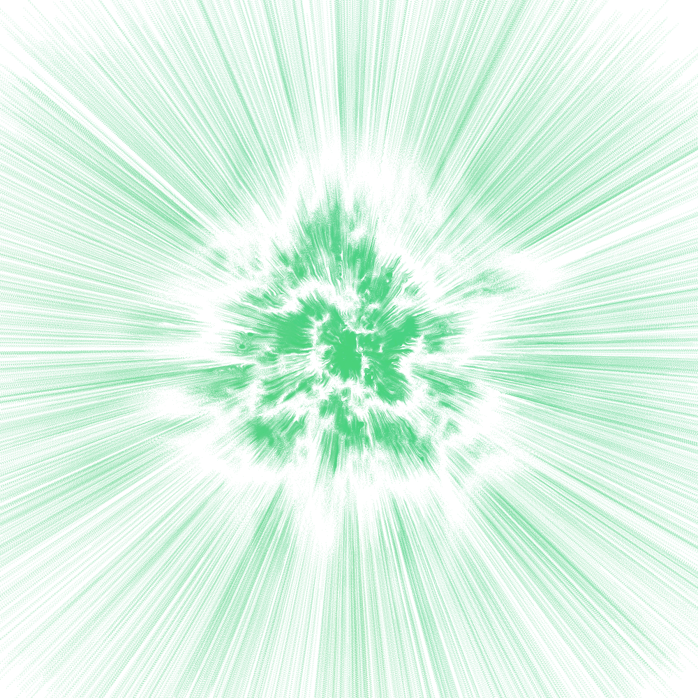
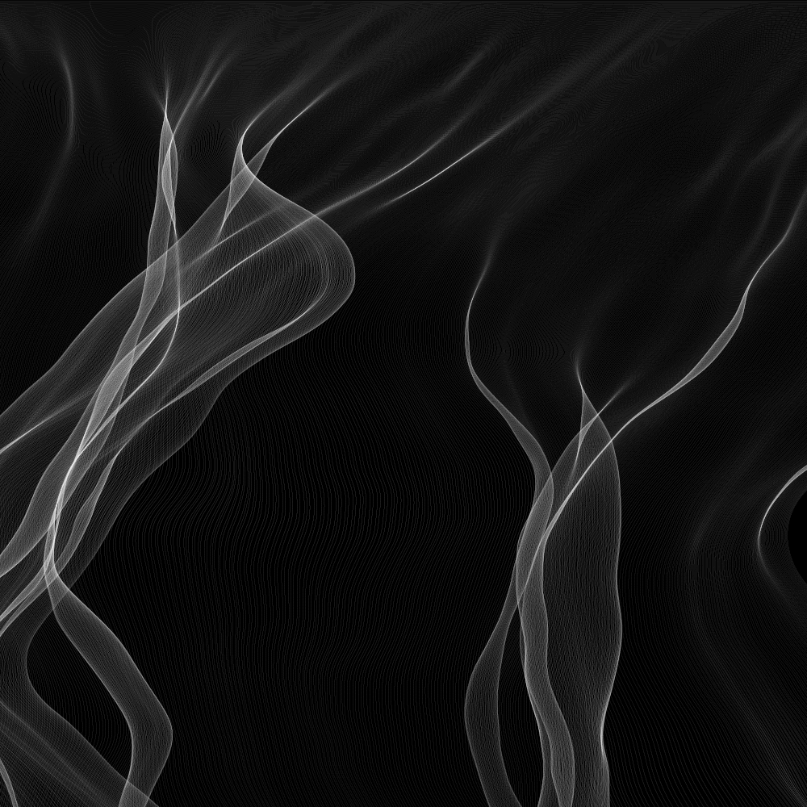

## ATTRACTORS

Strange attractors simulations from multiple models, with gui program, log scale option.

## ATTRACTOR_JS

Strange attractor web application, interactive.

## AUTONOM

Autonomous drawing agents

## BOTTOM

## BROKEN MOON

WIP, physically based model of gravitation on huge groups of particles

## CONNECTS

Elaborating a nice N-sphere repartition function

## DRAWGEN 

Autonomous drawing agents V2 based on pixel/gradient descent

## EMERALD

3D mesh temporal edition, particle systems in vector field

## FLAMES

Fractal flames

## GAMES/ALPHABET

Cool typing game :)

## GARDEN

Biologic simulations (flowers, trees, and mostly fluids)

## jacob/SIMILINOISE

Tweaking perlin noise to get patterns looking like biological cellules

## JAVATEMPLATE

cool templates

## LIFE

Game of life tiling

## OTHER/PAINTERA

Emulating paint

## PXLSORT

Pixel sorting program, base program by Kim Asendorf.
three color modes, angle for pixel rays, noise addition, gui program
cleanB does cool lines of sorting if randomscale is lowered and noisescale too

